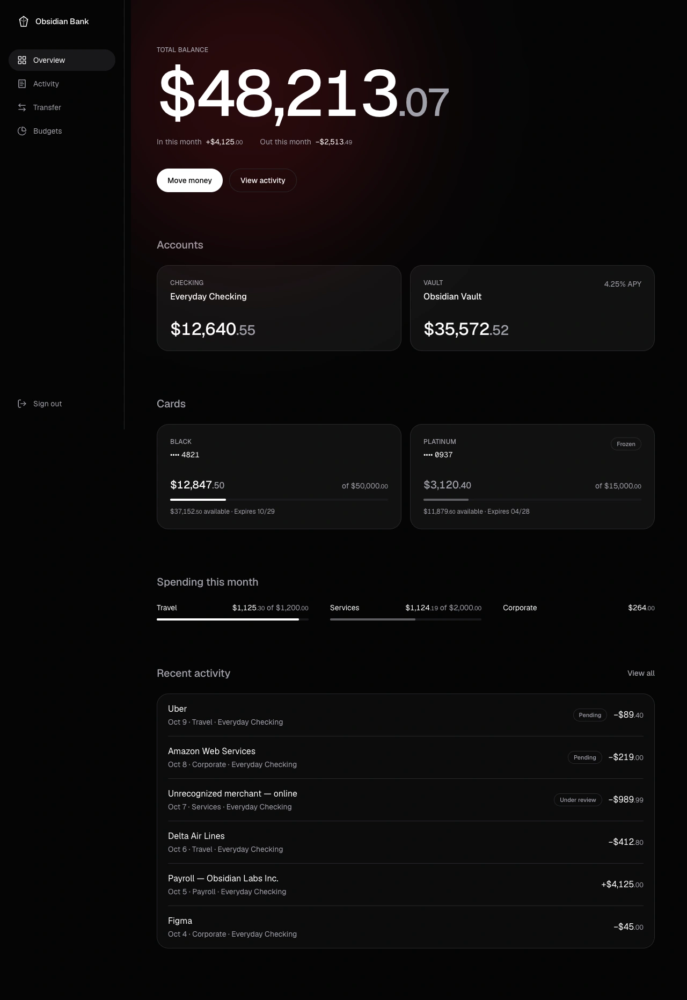
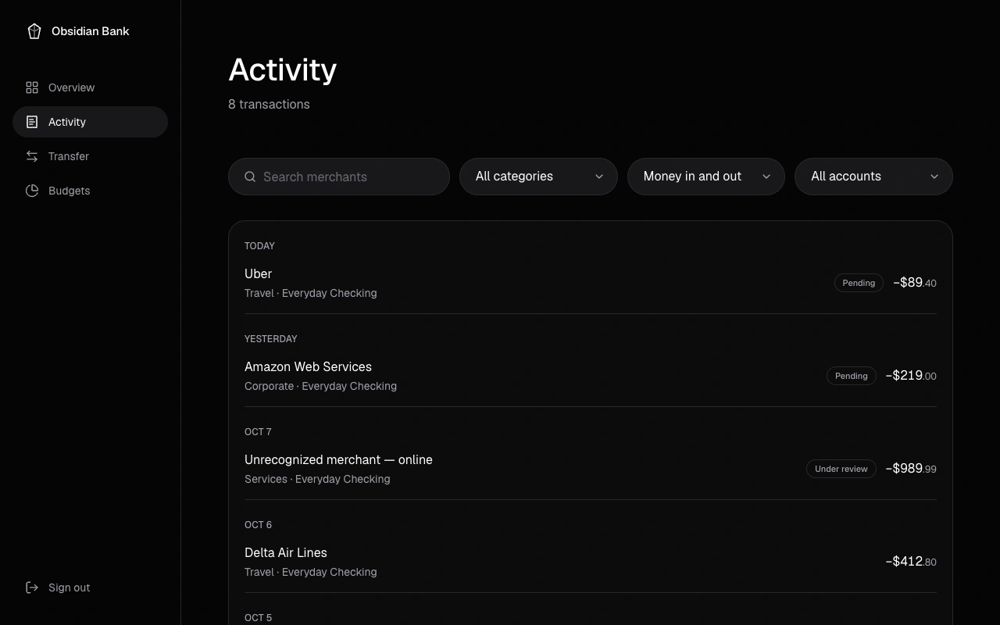
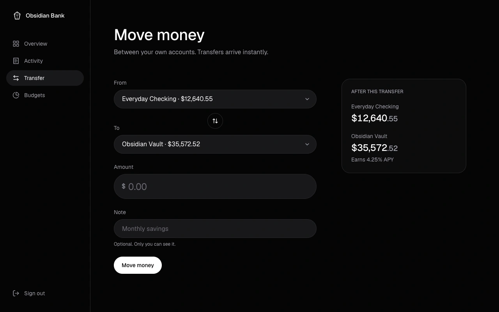
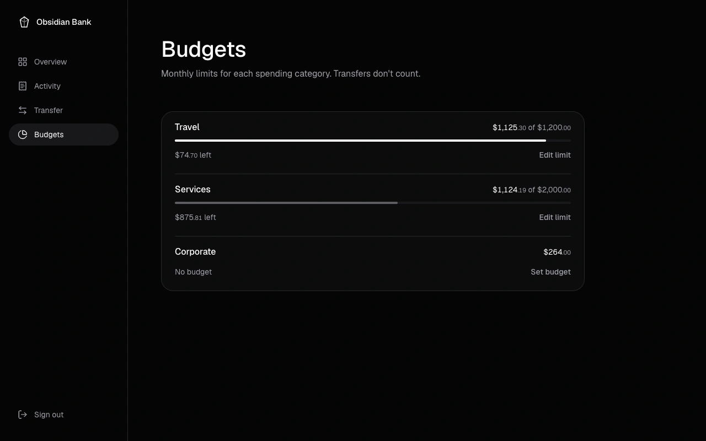
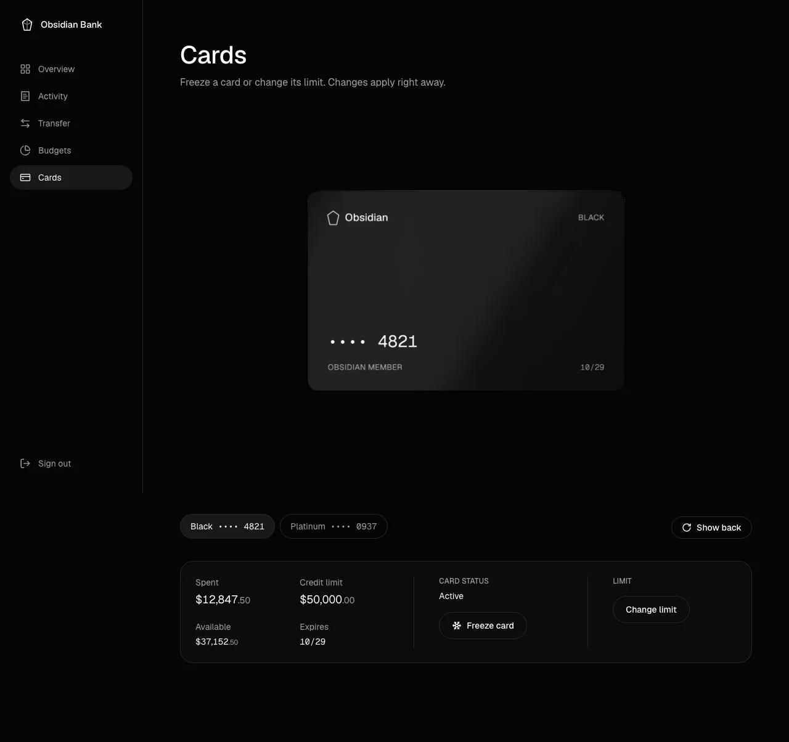

# Obsidian Bank

> **Demo project — not a real bank.** No real money, accounts or cards are involved. Built as a portfolio piece.

Personal banking app built with React 19, TypeScript and Supabase: accounts, cards, transactions, budgets and atomic server-side transfers. It is being rebuilt phase by phase; see [`docs/specs/`](docs/specs/).

Live demo: https://zsamir015.github.io/obsidian-bank/

**How to use it:** [user guide](docs/USER_GUIDE.md), screen by screen, for non-technical readers. **What's next:** [roadmap](ROADMAP.md).

| Overview                                                                                                                         | Activity                                                                                         |
| -------------------------------------------------------------------------------------------------------------------------------- | ------------------------------------------------------------------------------------------------ |
|    |  |
| **Move money**                                                                                                                   | **Budgets**                                                                                      |
|                                    |                |
| **Cards**                                                                                                                        |                                                                                                  |
|  |                                                                                                  |

<sub>Screenshots at 1280px with local demo data.</sub>

## Stack

Vite · React 19 · TypeScript (strict) · Tailwind CSS v4 · React Router · TanStack React Query · Zod + React Hook Form · React Three Fiber + Drei (cards page only) · Lucide · Geist (self-hosted) · Supabase (Postgres, Auth, Row Level Security, RPC) · Vitest + Testing Library + PGlite · ESLint · Prettier.

## Getting started

```sh
npm install
cp .env.example .env   # add your Supabase project URL and anon key
npm run dev
```

Apply the SQL in `supabase/migrations/` to your Supabase project, in order.

## Scripts

| Script              | What it does                                                               |
| ------------------- | -------------------------------------------------------------------------- |
| `npm run dev`       | Start the dev server                                                       |
| `npm run build`     | Typecheck and build for production                                         |
| `npm run lint`      | ESLint                                                                     |
| `npm run typecheck` | TypeScript project build check                                             |
| `npm test`          | Unit tests and database migration tests                                    |
| `npm run test:e2e`  | Playwright E2E against production (`npx playwright install chromium` once) |
| `npm run format`    | Prettier                                                                   |
| `npm run notices`   | Regenerate `THIRD_PARTY_NOTICES.md`                                        |
| `npm run db:types`  | Regenerate Supabase types (needs `supabase login`)                         |

## Implementation notes

- **Money** is stored and handled as integer cents. Amounts are always positive; a transaction's `type` (`debit` / `credit`) gives its direction.
- **Simplified balances.** An account's balance is the sum of all its transactions, including `pending` and `flagged` ones. A real bank would separate the posted balance from the available balance and hold pending charges apart; this demo keeps a single balance.
- **Migration tests run on PGlite.** `supabase/tests/` applies every migration to [PGlite](https://pglite.dev/) (Postgres compiled to WebAssembly, in memory) with a small stub of Supabase's `auth` schema and API roles. That checks constraints, Row Level Security, the transfer function and the demo data without Docker or a live database. It is close to Supabase but not identical, so migrations are still reviewed before being applied to production.
- **Demo users are cleaned up automatically.** Each visit to the demo signs in anonymously and gets its own seeded data. A daily `pg_cron` job (04:17 UTC) deletes anonymous users with no activity for more than 7 days, together with their accounts, cards, transactions and budgets. Non-anonymous users are never touched. PGlite has no `pg_cron`, so the cleanup function is tested on its own and the scheduling migration is checked statically.
- **Initial load: 179 kB of JavaScript (gzip).** Measured in Chrome as every JS file downloaded to render the overview from a cold cache (production build, Supabase responses mocked). Each route is its own chunk, so other pages add only a few kB when visited. By package, the minified code that loads is:

  | Part                                     | Share |
  | ---------------------------------------- | ----- |
  | Supabase client (`@supabase/*`)          | 35%   |
  | React + React DOM                        | 35%   |
  | React Router                             | 15%   |
  | TanStack Query                           | 6%    |
  | Class merging (`tailwind-merge`, `clsx`) | 5%    |
  | App code                                 | 4%    |
  | Lucide icons                             | 1%    |

  The Supabase client is needed at startup to restore the session, so it stays in the initial bundle. The pre-redesign single bundle was 306 kB.

- **Cards** only ever store the last four digits; never the full card number or CVV.

## How the 3D card loads

`/cards` shows an interactive 3D card, but three.js never reaches the initial bundle:

1. **Route chunk.** `/cards` is a lazy route like every page; its chunk (~4 kB gzip) holds the page, the controls and the static card.
2. **Capability check.** On mount, `CardVisual` runs the 3D card only if the browser has WebGL and the user has not asked for reduced motion.
3. **3D chunk.** Only then does `React.lazy` request the 3D chunk: three.js, React Three Fiber, Drei, @use-gesture and maath, 273 kB gzip in the build output. While it downloads, the static CSS card is shown in its place, so the layout does not move.
4. **Fallbacks.** An error boundary switches to the static card if the chunk fails to load, and so does a lost WebGL context (`webglcontextlost`). The static card shows the same details: tier, last four digits, holder, expiry and frozen state.

The card is presented like a product on a studio set: drag it to turn it (free around the vertical axis, limited tilt) and on release it settles on the nearest face; "Show back / Show front" turns it with the keyboard too. At rest it floats and swings slowly, and stops after about 30 seconds without interaction. The entrance from edge-on plays once per session.

Inside the 3D card, `frameloop="demand"` draws frames only while something moves, and the frame loop stops entirely while the card is off screen or the tab is in the background. Drag input is applied in `useFrame` (no React re-render per pointer move), with critically damped easing from maath (no bounce). `dpr` is capped at 2, reflections come from Lightformers built in code (no HDR files), the contact shadow is baked once, and both faces are canvas textures drawn after the web fonts load. On touch screens a vertical swipe keeps scrolling; a horizontal drag turns the card. With reduced motion the static card is shown and changes face instantly. Freeze and limit controls are regular HTML, outside the canvas, which is marked decorative.

## License

[MIT](LICENSE) © 2026 Samir Lorenzo. Third-party packages and fonts keep their own licenses; see [THIRD_PARTY_NOTICES.md](THIRD_PARTY_NOTICES.md) (regenerate with `npm run notices`).
