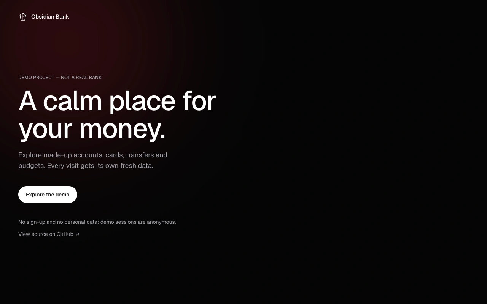
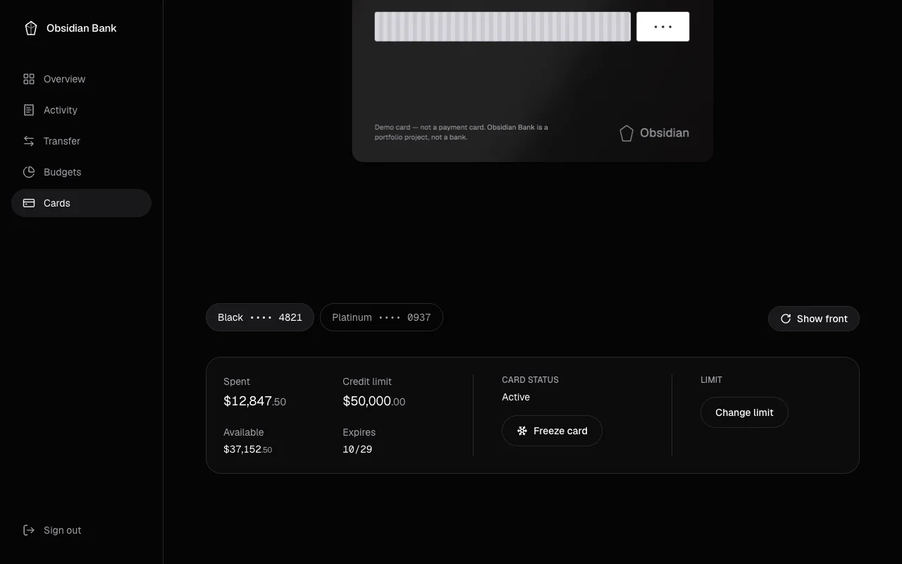

# Obsidian Bank user guide

This guide explains how to use the Obsidian Bank demo, screen by screen. You don't need any technical knowledge to follow it.

> **Obsidian Bank is a demo, not a real bank.** No real money, accounts or cards are involved. Everything you see is made up.

**Contents:** [Getting started](#getting-started) · [Overview](#overview) · [Activity](#activity) · [Move money](#move-money) · [Budgets](#budgets) · [Cards](#cards) · [Accessibility](#accessibility) · [Troubleshooting](#troubleshooting) · [Glossary](#glossary)

## Getting started

Open the demo at <https://zsamir015.github.io/obsidian-bank/> and select **Explore the demo**.

- **No sign-up.** You don't create an account or give any personal data. The demo signs you in anonymously with a private session of your own.
- **Your own sample data.** Each new session starts with invented accounts, cards, transactions and budgets. What you do (transfers, freezing a card, new limits) is saved in your session, and nobody else sees it.
- **Sessions are deleted after 7 days of inactivity.** Once a day, sessions with no activity in the last 7 days are deleted with all their data. If you come back later you get a fresh session with new sample data.
- **Sign out** (at the bottom of the menu on a computer, top right on a phone) ends your session. Exploring the demo again starts a new one.

The menu is on the left on a computer and at the bottom of the screen on a phone.

## Overview

The first screen after signing in. It summarises your money at a glance.

**What you see**

- **Total available:** the money you can use across all accounts. **Ledger balance** is the settled total; available subtracts pending and under-review debits. Below it, **In this month** is the money that came in since the 1st, and **Out this month** is the money that went out. Moving money between your own accounts doesn't count as either.
- **Move money:** a shortcut to the transfer screen.
- **Accounts:** each account's available balance and its ledger balance. A **Vault** also shows the interest rate it earns (for example _4.25% APY_).
- **Cards:** each card by tier and last four digits, with a bar showing how much of its limit is used. Frozen cards are marked **Frozen**. **Manage** opens the Cards screen.
- **Spending this month:** what you've spent in each category, compared with the budget you set for it.
- **Recent activity:** your latest transactions. **View all** opens the Activity screen.

## Activity

Every transaction, newest first, grouped by day (_Today_, _Yesterday_, then dates).

**How to use it**

1. Type in **Search merchants** to find a merchant by name, for example _Uber_.
2. Narrow the list with the filters:
   - **Money in and out / Money in / Money out:** show everything, only money received, or only money spent.
   - **All categories:** one category, such as _Travel_.
   - **All accounts:** one account, such as your Vault.
3. Filters combine. If nothing matches, the screen says _No transactions match these filters_. Change or clear a filter to see results again.

**What each row means**

- Merchant and category on the left, amount on the right. Money in shows a **+**, money out a **−**.
- A **Pending** tag means the payment hasn't settled yet. **Under review** means it was flagged for a check. Both are explained in the [glossary](#glossary).

## Move money

Moves money between your own accounts, for example from Checking to your Vault, or sends it to an account at another US bank. In the menu it's called **Transfer**. Choose **Between my accounts** or **To another bank** at the top of the page.

### Between my accounts

**Step by step**

1. In **From**, choose the account the money leaves.
2. In **To**, choose the account it goes to. The swap button between them (_Swap accounts_) switches From and To.
3. Enter the **Amount** in dollars, using a dot for cents, like `25.50`.
4. Optionally add a **Note** (up to 140 characters). Only you can see it.
5. Check **After this transfer** on the right: it shows the available and ledger balances after the money moves.
6. Select **Move money**. The transfer arrives instantly. Select **Make another transfer** to start again; the new balances already show on your Overview.

**Rules**

- The two accounts must be different.
- The amount must be more than $0.00 and no more than the From account's available balance. Pending and under-review debits reduce what's available even though they haven't settled. The server checks this balance when processing the transfer.
- A transfer either completes in full or not at all: it never leaves money half-moved.
- Transfers between your own accounts are not income or spending. They don't count in budgets or in _In this month_ and _Out this month_.

### To another bank

Sends money to someone else's account at a US bank, using the bank's routing number and the account number.

This is a demo. Obsidian Bank doesn't connect to ACH, Fedwire or any other payment network, the recipient and their bank are not contacted, and no money leaves the app. The page says so above the form.

**Step by step**

1. Select **To another bank**.
2. In **From**, choose the account the money leaves.
3. Enter the **Recipient name**.
4. Enter the 9-digit **Routing number**. It's printed at the bottom left of a check, before the account number.
5. Enter the **Account number** (4 to 17 digits). When you leave the field it's replaced by _Ending in_ and its last four digits; the full number is not kept anywhere. Select **Change** to enter it again.
6. Enter the **Amount** and, optionally, a **Note**.
7. Select **Send transfer**.

**What happens next**

- The transfer shows in Activity straight away as **Pending**, with the category _External transfer_, the recipient's name and the last four digits of their account.
- It's taken from your available balance at once. Your ledger balance changes when it settles.
- Settling is simulated: about 2 minutes after you send it, the transfer is marked as completed the next time your balances or activity load (for example when you open Overview or Activity, or reload the page). It doesn't happen while the app is closed, and nothing runs in the background.

**Rules**

- The routing number must be a valid US (ABA) routing number. The app checks its prefix and its check digit, both in the browser and again on the server.
- Each transfer can be up to $10,000.00, and external transfers can add up to $25,000.00 in any 24 hours, counting pending and settled ones from all your accounts.
- The amount can't be more than the From account's available balance.
- Money sent to another bank counts in _Out this month_. It has no budget category, so it doesn't count against any budget.
- A transfer is either recorded in full or not at all.

## Budgets

Monthly spending limits for each category: Corporate, Travel, Services and Payroll.

**How to use it**

1. Find the category. Without a limit it says **No budget**.
2. Select **Set budget** (or **Edit limit** if it already has one).
3. Enter the monthly limit in dollars, like `1500`. It must be more than $0.00.
4. Save. The bar and the text below it update right away.

**What it shows**

- The bar fills as you spend during the month.
- The text below says how much is **left**, or how much you are **Over by** once spending passes the limit. Going over isn't an error. The demo doesn't block payments; the budget is there to inform you.
- Only money spent counts. Transfers between your own accounts never count.

## Cards

Shows each card as a 3D model you can turn, with its controls below.

**Choose a card:** select it by tier and last four digits, for example **Black •••• 4821**.

**Turn the card**

- **With a mouse:** drag the card left or right. Let go and it settles on whichever side faces you most.
- **On a phone:** swipe sideways on the card. Swiping up or down scrolls the page as usual.
- **Show back / Show front** turns the card over without dragging. It works with the keyboard too.
- Left alone, the card floats and swings gently for a while, then stops.

The back has a magnetic stripe, a signature panel and a note that it's a demo card. The security code shows only as `•••`: the demo never stores a full card number or security code.

**Card details**

- **Spent:** what's been charged to the card.
- **Credit limit:** the most the card can spend.
- **Available:** what's left to spend: credit limit minus spent.
- **Expires:** month and year the card expires.

**Freeze or unfreeze a card**

1. Select **Freeze card**. The status changes to _Frozen: new payments are declined_ and the card shows a **FROZEN** label.
2. Select **Unfreeze card** to use it again.

**Change the limit**

1. Select **Change limit**.
2. Enter the new **credit limit** in whole dollars, like `15000` (no cents).
3. Select **Save limit**. A message confirms the new limit.

**Limit rules**

- From **$500 to $100,000**, in whole dollars.
- Never below what has already been spent on the card. The field tells you the real minimum, rounded up to the next dollar, for example _Whole dollars from $12,848 to $100,000_.

## Accessibility

- **Keyboard:** everything works without a mouse. Press **Tab** to move between controls and **Enter** or **Space** to use them. The first Tab offers **Skip to content**, which jumps past the menu. On Cards, use the arrow keys to switch between cards and **Show back / Show front** to turn the card.
- **Reduced motion:** if your device is set to reduce motion (an accessibility setting on Windows, macOS, iOS and Android), the demo shows a still card with no floating, swinging or entrance animation, and turning the card over happens instantly.
- **Without 3D:** if your browser or device can't show 3D graphics (WebGL), the Cards screen shows a flat version of the card with the same details, front and back. Every control works the same.
- **Screen readers:** the 3D card is decorative. The card's details and status are available as text in the controls below it.

## Troubleshooting

**"This page didn't load"**
The app was updated while you had it open, so part of the screen couldn't be downloaded (it can also happen when the connection drops). Select **Reload** to get the latest version.

**"Something went wrong"**
The screen hit an unexpected error. Select **Back to overview** and try again.

**"Couldn't load your …"** (balance, cards, activity, budgets)
The data didn't arrive. Select **Try again**. If it keeps happening, check your connection.

**"Couldn't start the demo"**
The anonymous session couldn't be created. Wait a few seconds and select **Explore the demo** again.

**"Your session ended. Sign in again to continue."**
Your session expired or was deleted after 7 days of inactivity. Sign in again to get a new session with fresh sample data.

**My data changed or disappeared**
Sessions inactive for more than 7 days are deleted. A new session starts with new sample data.

**The 3D card doesn't appear**

- A flat card instead of a 3D one is expected when reduced motion is on, or when the browser can't use 3D graphics (WebGL). See [Accessibility](#accessibility).
- On a slow connection, the flat card shows while the 3D one downloads.
- If 3D graphics stop working (for example after the computer wakes from sleep), the flat card takes over. Reload the page to try 3D again.

**"This page doesn't exist" (Error 404)**
The address is wrong or out of date. Select **Back to overview**.

## Glossary

- **APY (annual percentage yield):** the interest an account earns over a year, including interest on interest. Shown on the Vault, for example _4.25% APY_.
- **Available balance:** the settled ledger balance minus pending and under-review debits. This is the amount an internal transfer can use.
- **Ledger balance:** the net total of completed (settled) credits and debits in an account.
- **Vault:** a savings account. Move money in and out of it with **Move money**.
- **Routing number (ABA):** the 9-digit number that identifies a US bank. Its last digit is a check digit, so most typing mistakes are caught.
- **Settlement:** when a pending payment becomes final. In this demo, transfers to another bank settle about 2 minutes after they're sent, the next time your balances or activity load.
- **Pending:** a payment that has been made but not settled yet. It's already listed, and it can still change before it settles.
- **Under review:** a transaction flagged for a check, for example an unusual payment. In a real bank someone would confirm it with you.
- **Available (card):** how much you can still spend: credit limit minus what's been spent.
